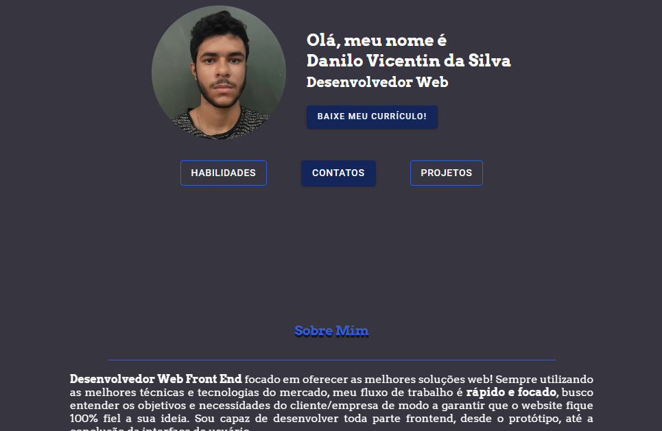

# portfolio-danilo-vicentin

Olá! Sou Danilo, desenvolvedor de sites. Desenvolvedor Web Front End focado em oferecer _as melhores soluções web_! Sempre utilizando as melhores técnicas e tecnologias do mercado, meu fluxo de trabalho é _rápido e focado_, busco entender os objetivos e necessidades do cliente/empresa de modo a garantir que o website fique _100% fiel a sua ideia_. Sou capaz de desenvolver seu site, _desde o protótipo/rascunho_, até a conclusão da interface de usuário.

## Acessando/Executando o site

- Voce pode acessar [aqui](https://portfolio-danilo-vicentin.vercel.app/)

### Tecnologias Usadas

- React (com Vite)
- Typescript
- Javascript
- HTML
- CSS
- Outras libs...

### Compartilhe, Contribua e Acesse
